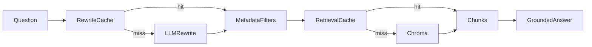

# infrastructure-copilot

A local RAG assistant that answers infrastructure questions from fake runbooks and incident history, and cites the chunks it used.

## How it works



The rewrite cache is keyed by the question after lowercasing and collapsing whitespace. A hit skips the LLM rewrite. Retrieval is keyed by the rewritten query, filters, and `k`. A hit skips the embedding and the Chroma query. Filters relax one field at a time if too few chunks match. The answer uses only those chunks, and a step is dropped when a citation is not in the retrieved set.

## Results

From [eval/results.md](eval/results.md).

| Setup | Precision@3 |
| --- | --- |
| Plain vector search | 0.6444 |
| Rewriting only | 0.6444 |
| Rewriting + metadata filters | 0.6444 |

Rewrite fell back to the raw query with no filters on 30 of 30 questions, because no API key was set.

### Retrieval stage

| Mode | Samples | Median (ms) | P95 (ms) |
| --- | --- | --- | --- |
| Cache off | 48 | 72.87 | 90.64 |
| Cache on, warm | 48 | 0.01 | 0.01 |

Median reduction, warm versus cache off: 99.99% ((72.87 - 0.01) / 72.87). This is embedding plus Chroma, or a cache read. Rewrite is not included.

### End to end, including rewrite

| Mode | Samples | Median (ms) | P95 (ms) |
| --- | --- | --- | --- |
| Cache off | 48 | 83.76 | 161.00 |
| Cache on, warm | 48 | 0.01 | 0.02 |

Median reduction, warm versus cache off: 99.98% ((83.76 - 0.01) / 83.76). Cache-off rewrite did not reach an LLM (48 fallbacks). This timing is the fallback plus retrieval, not a live model call.

Cut repeated-query retrieval latency 99.99%. That sentence is the retrieval-stage number only.

## Setup

```bash
python3.11 -m venv .venv
source .venv/bin/activate
pip install -r requirements.txt
cp .env.example .env
```

Set `LLM_PROVIDER` to `openai` or `anthropic` and put the matching key in `.env`. Keys are read from the environment. Embeddings are local. The first ingest downloads Chroma's MiniLM model and needs a network.

```bash
python -m src.ingest
python -m src.cli "why is payments-db-01 in prod out of disk space?" --show-filters --show-sources
```

Other flags: `--no-cache`, `--show-sources`, `--show-filters`. `--no-cache` skips both the rewrite cache and the retrieval cache.

```bash
python eval/run_precision.py
python eval/run_latency.py
pytest
```

On a fresh database, ingest stored 128 chunks and skipped 2 exact duplicates and 2 near-duplicates (similarity 0.999). Running it again against that database stored 0, skipped 130 exact duplicates, and skipped the same 2 near-duplicates.

## Example

This run had no API key, so the rewrite fell back and the assistant did not invent an answer:

```
$ python -m src.cli "why is payments-db-01 in prod out of disk space?" --show-filters --show-sources

Rewritten query: why is payments-db-01 in prod out of disk space?
Filters: (none)
Filters applied: (none)
Rewrite cache: miss
Cache: miss
  attempt filters=(none) hits=5

[runbook:disk-full#1] distance=0.335
## Likely cause
The payments-db data volume filled because WAL files and nightly base backups were retained on the same disk as the primary data directory. A bulk settlement job kept transactions open, so the WAL could not be recycled. The disk full incident is on payments-db-01 in prod. Free space must be restored before writes succeed.

[runbook:disk-full#0] distance=0.348
## Symptoms
Payments database host payments-db-01 in prod reports disk full. Postgres logs show "No space left on device" while writing WAL segments. Write queries fail and the payments service starts failing card charges. df shows the data volume at 100 percent used. The Payments Platform alert pages on-call Avery Chen. This is an out of disk condition on the payments db, not a slow query.

[inventory:payments-db-01] distance=0.381
Host payments-db-01 runs service payments-db in the prod environment in region us-east-1. Owner team: Payments Platform. Primary writer for card charges. The live WAL volume sits on this host.

[runbook:db-pool-exhausted#1] distance=0.393
## Likely cause
A leaked transaction in the payments service held pool connections until the pool was exhausted. The payments database itself is accepting local connections. The timeout is at the application pool on the path to payments-db-01 in prod, not a disk full event.

[runbook:db-pool-exhausted#0] distance=0.404
## Symptoms
The payments db in prod is timing out. checkout cannot charge cards because payments-db-01 refuses new db sessions. Application logs say the connection pool is exhausted and waits exceed the timeout. CPU and disk on the database host are healthy. Payments Platform on-call Avery Chen is paged.
Latency: 451 ms
LLM request failed: OPENAI_API_KEY is not set.
```

With a key, the answer is printed after that retrieval block. A step stays only when every bracketed id was retrieved:

```
Likely cause: ... [runbook:disk-full#1]
Steps to try:
- ... [runbook:disk-full#2]
Sources: [runbook:disk-full#1], [runbook:disk-full#2]
```

## Limitations

The runbooks, hosts, owners, and incidents are invented. The stored collection is 128 chunks, so these scores will not match a large corpus. Precision@3 is the same for all three setups in this run because rewrite had no API key and applied no filters.

Retrieval-stage latency and end-to-end latency are different measurements. The 99.99% drop (72.87 ms to 0.01 ms) is only the embed and Chroma step. The end-to-end drop in this run (83.76 ms to 0.01 ms, 99.98%) did not include a live rewrite model call, because that call fell back immediately. Do not quote 99.98% as the speedup once an LLM is in the path. A warm question skips both the rewrite call and the Chroma query. A cache miss still waits on the model, then on retrieval.
